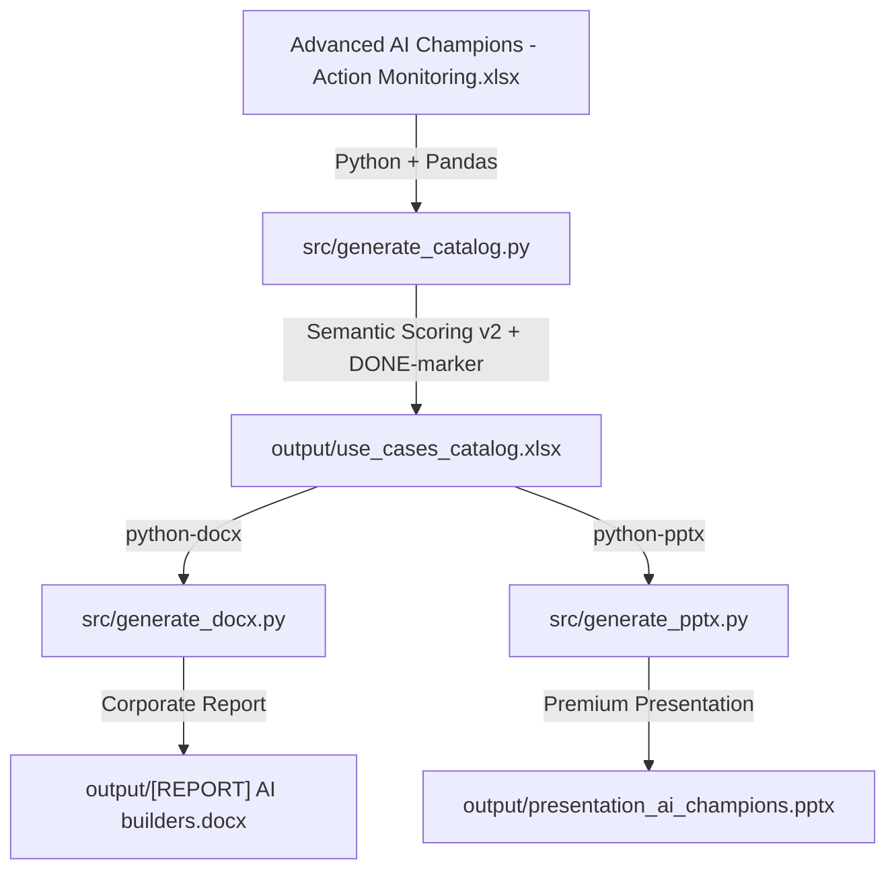

<!-- Generated: 2026-05-21 | Files scanned: 3 | Token estimate: ~300 -->

# High-Level Architecture — Use Cases AI Champions

## System Diagram

## Data Flow & Processing Pipeline
1. **Extraction**: `generate_catalog.py` reads raw data from the Excel spreadsheet.
2. **Analysis & Enrichment**:
   - Classifies tools and maps them to clean categories.
   - Detects mature/completed use cases via description-based semantic indicators (DONE-markers).
   - Recalculates prospective remaining complexity scores (Small/Medium/Large).
   - Evaluates enterprise security exposure (IT Flag & IT Attention triggers).
3. **Generation**:
   - `output/use_cases_catalog.xlsx`: Cleaned, structured database for downstream use.
   - `output/[REPORT] AI builders.docx`: Structured corporate report summarizing key statistics, families, and recommendations.
   - `output/presentation_ai_champions.pptx`: Polished slideshow presenting the analysis to executives.
